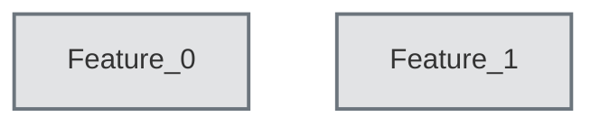

# Architecture Recovery Report

## Feature Architecture Reflexion Model

This document contains the automatically recovered software architecture based on dynamic traces and static LSI mappings.

## Component Details

### Feature_0
- `app.py::query`
- `app.py::__init__`
- `app.py::login`
- `app.py::logout`

### Feature_1
- `test_app.py::test_login`
- `test_app.py::test_logout`
